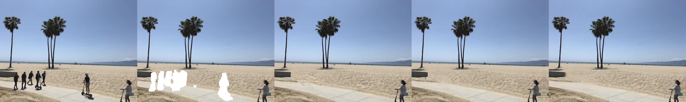
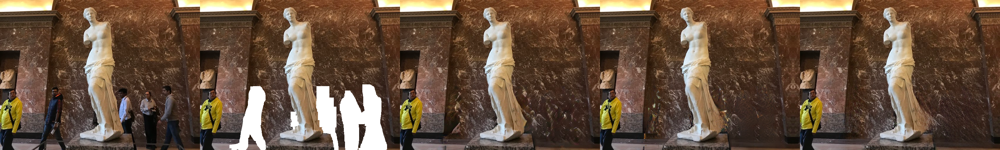
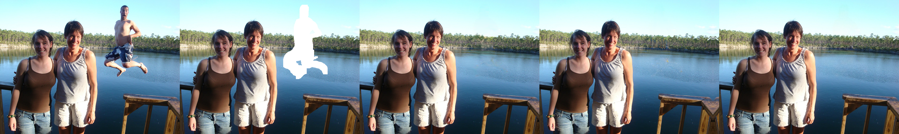

## DeepFillv2_Pytorch
This is a Pytorch re-implementation for the paper [Free-Form Image Inpainting with Gated Convolution](https://arxiv.org/abs/1806.03589).  

This repository contains "Gated Convolution", "Contextual Attention" and "Spectral Normalization".
## Requirement
- Python 3
- OpenCV-Python
- Numpy
- Pytorch 1.0+
## Compared Results
The following images are **Original**, **Masked_orig**, **Official(Tensorflow)**, [**MMEditing(Pytorch)**](https://github.com/open-mmlab/mmediting), **Ours(Pytorch)**.
### 
### 
### 
### 
### 
### 
## Dataset
### Training Dataset
The training dataset is a collection of images from [Places365-Standard](http://places2.csail.mit.edu/download.html) which spatial sizes are larger than 512 * 512. (It will be more free to crop image with larger resolution during training)
### Testing Dataset
Create the folders `test_data` and `test_data_mask`. Note that `test_data` and `test_data_mask` contain the image and its corresponding mask respectively.
## Training
* To train a model:
``` bash
$ bash ./run_train.sh
``` 
All training models and sample images will be saved in `./models/` and `./samples/` respectively.
## Testing
Download the pretrained model [here](https://drive.google.com/file/d/1uMghKl883-9hDLhSiI8lRbHCzCmmRwV-/view?usp=sharing) and put it in `./pretrained_model/`.
* To test a model:
``` bash
$ bash ./run_test.sh
``` 
## Acknowledgments
The main code is based upon [deepfillv2](https://github.com/zhaoyuzhi/deepfillv2).  
The code of "Contextual Attention" is based upon [generative-inpainting-pytorch](https://github.com/daa233/generative-inpainting-pytorch).  
Thanks for their excellent works!  
And Thanks for [Kuaishou Technology Co., Ltd](https://www.kuaishou.com/en) providing the hardware support to this project.
## Citation
```
@article{yu2018generative,
  title={Generative Image Inpainting with Contextual Attention},
  author={Yu, Jiahui and Lin, Zhe and Yang, Jimei and Shen, Xiaohui and Lu, Xin and Huang, Thomas S},
  journal={arXiv preprint arXiv:1801.07892},
  year={2018}
}

@article{yu2018free,
  title={Free-Form Image Inpainting with Gated Convolution},
  author={Yu, Jiahui and Lin, Zhe and Yang, Jimei and Shen, Xiaohui and Lu, Xin and Huang, Thomas S},
  journal={arXiv preprint arXiv:1806.03589},
  year={2018}
}
```
